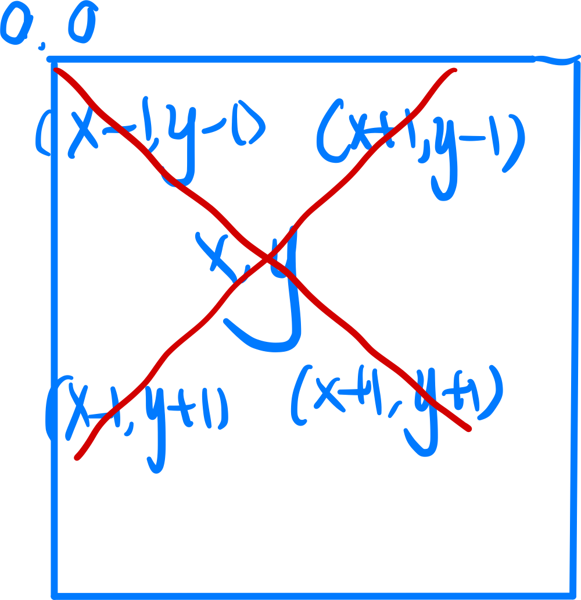
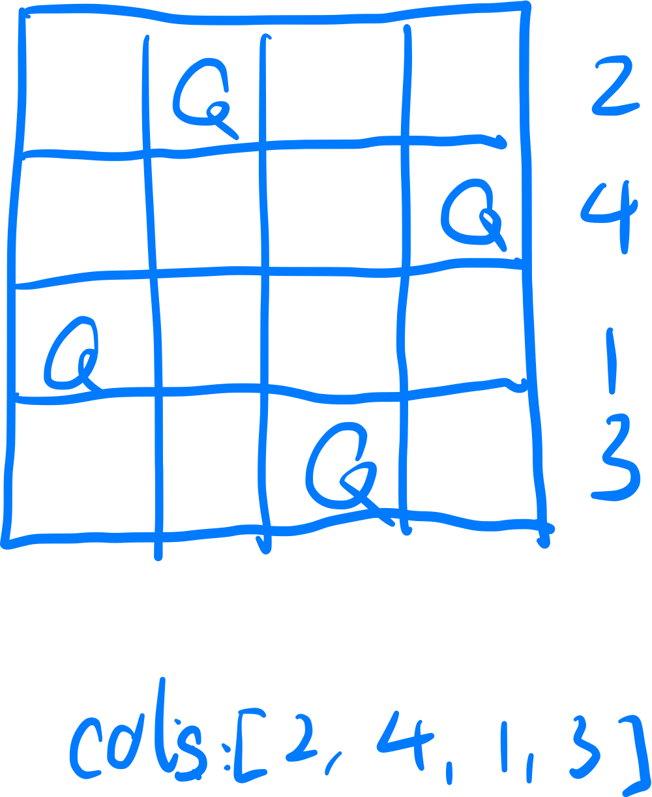

# Problem
[33 N-queen](https://www.lintcode.com/problem/33/)

## Problem Description
```
The n-queens puzzle is the problem of placing n queens on an n×n chessboard such that no two queens attack each other(Any two queens can't be in the same row, column, diagonal line).

Given an integer n, return all distinct solutions to the n-queens puzzle.

Each solution contains a distinct board configuration of the n-queens' placement, where 'Q' and '.' each indicate a queen and an empty space respectively.

Input:4
Output:
[
  // Solution 1
  [".Q..",
   "...Q",
   "Q...",
   "..Q."
  ],
  // Solution 2
  ["..Q.",
   "Q...",
   "...Q",
   ".Q.."
  ]
]
```
## Tags
@DFS

# Solution
isValid Funtion: we need avoid three situations: when Queens are in same diagional line,   
x + y = (x + 1) + (y - 1)  
or:  
x - y = (x - 1) - (y - 1)  
<div style="text-align: center;">
    
</div>

cols: the column number of queens, from the first row to the nth row.
<div style="text-align: center;">
    
</div>

# Code  

```java
public class Solution {
    /*
     * @param n: The number of queens
     * @return: All distinct solutions
     */
    public List<List<String>> solveNQueens(int n) {
        // write your code here
        List<List<String>> ret = new ArrayList<>();
        
        if (n <= 0) {
            return ret;
        }
        
        search(ret, new ArrayList<Integer>(), n);
        
        return ret;
    }
    
    // recursively get possible position of queen in each level
    // @cols: the column number of queens, from the first row to the nth row.
    private void search(List<List<String>> results, List<Integer> cols, int n) {
        // exit, find a solution.
        if (cols.size() == n) {
            results.add(Draw(cols));
            return ;
        }
        
        // recursion, get column index of queen which is legal for current row. O(n!)
        for (int colIndex = 0; colIndex < n; colIndex++) {
            if (!isValid(cols, colIndex)) {
                continue;
            }
            
            cols.add(colIndex);
            search(results, cols, n);
            cols.remove(cols.size() - 1); // back tracking
        }
        
        return ;
    }
    
    private boolean isValid(List<Integer> cols, int colCandidate) {
        int row = cols.size(); // @cols, row: current row
        // Do recursion to estimate each row before current row
        for (int rowIndex = 0; rowIndex < row; rowIndex++) {
            // three cases make the queen illegal:
            // 1. same col
            if (cols.get(rowIndex) == colCandidate) {
                return false;
            }
            
            // diagonal line: up to down 
            if (row - colCandidate == rowIndex - cols.get(rowIndex)) {
                return false;
            }
            // diagonal line: down to up
            if (row + colCandidate == rowIndex + cols.get(rowIndex)) {
                return false;
            }
        }
        
        return true;
    }
    
    private List<String> Draw(List<Integer> cols) {
        List<String> ret = new ArrayList<>();
        
        for (int i = 0; i < cols.size(); i++) { // each row
            StringBuilder sb = new StringBuilder();
            for (int j = 0; j < cols.size(); j++) { // each col
                sb.append(j == cols.get(i) ? 'Q' : '.');
            }
            
            ret.add(sb.toString());
        }
        
        return ret;
    }
}
```
## Complexity Analysis
- Time Complexity: O(S * n ^ 2) S: count of solutions.  draw a n x n graph costs n ^ 2
- Space Complexity: O()

## follow up:
[Nqueen 2](./lint34_NQueen2.md)